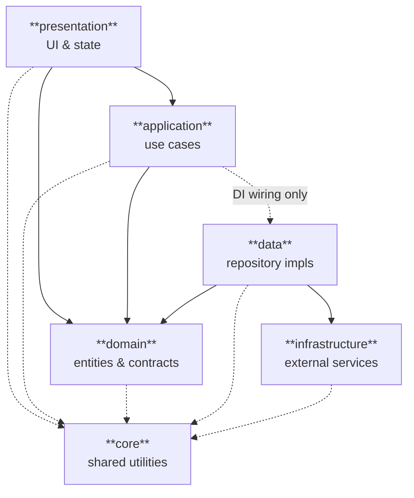

# flutter_clean_arch_riverpod

A simple Flutter app built to demonstrate **Clean Architecture** in practice, using **Riverpod** for state management/DI and **AutoRoute** for navigation. It's a small crypto quotes app — intentionally simple so the architecture, not the feature set, stays the focus.

## Features

- Live crypto quotes list with pull-to-refresh and symbol filtering
- Quote detail screen with a candlestick (kline) chart
- Favorite/unfavorite quotes, with a dedicated favorites tab
- User preferences: dark mode, font scale, and locale
- Internationalization (English, Spanish, Portuguese)

## Getting Started

### Prerequisites

- [FVM](https://fvm.app/) (Flutter Version Management) — used to pin the exact Flutter version this project targets.

### 1. Configure the Flutter environment

```bash
make fvm
```

This installs FVM (if needed) and pins the Flutter SDK to the version this project expects (see `.fvmrc`), so your local `flutter` matches what CI/other contributors use.

### 2. Generate code and install dependencies

```bash
make runner
```

Runs `build_runner build` (generates `.freezed.dart`/`.g.dart`/`.gr.dart` files), then `flutter clean` + `flutter pub get`.

```bash
make l10n
```

Generates the localization classes (`AppLocalizations` and friends) from the `.arb` files.

Run both once after cloning, and again whenever generated code needs to be rebuilt from scratch. If generated files get into a broken state, `make runner-hard` deletes all of them first before regenerating.

### 3. Run the app

```bash
flutter run
```

### 4. Run the tests

```bash
make flutter-test              # test/ — unit + widget + integration, with an HTML coverage report
make flutter-test-unit         # test/unit only — every class in isolation
make flutter-test-widget       # test/widget only — screens and widgets, mocked
make flutter-test-integration  # test/integration only — real cross-layer flows
make flutter-test-e2e          # integration_test/ — the real app on a device/emulator
```

The first four run on the host Dart VM and open the generated HTML coverage report (`coverage/html/**/index.html`) when they finish. `make flutter-test-e2e` needs a connected device or emulator and produces no coverage. See [Tests](#tests) for what each level actually covers.

## Architecture at a Glance



Arrows point from the dependent to the dependency, so they all run toward `domain` — the center of the app. Two details the plain rule doesn't capture:

- **`data` depends on `infrastructure`**, because the contracts (`HttpClientInterface`, `StorageInterface`) live in `infrastructure/` rather than in an inner layer. A strict reading of the Dependency Rule would invert this; the tradeoff is discussed under [Architecture](#architecture).
- **`application` reaches `data`** in its `*_di.dart` files only — the composition root, never the use cases themselves.

`core` is imported by everything, including `domain` (whose repository contracts return `Failure`). Details below.

## Architecture

This project follows **Clean Architecture** with **DDD (Domain-Driven Design)** influences.

The two are not complementary halves of one model — they're competing vocabularies that each cover the whole app. Evans' layered architecture (DDD, 2003, ch. 4) names four layers: User Interface, Application, Domain, Infrastructure. Uncle Bob's Clean Architecture names four concentric rings: Entities, Use Cases, Interface Adapters, Frameworks & Drivers. In a codebase this size they land on the same partition, so this project uses one set of folders and both sets of names map onto it:

| Folder | Responsibility | DDD layer | Clean Arch ring |
|---|---|---|---|
| `domain/` | Business rules, entities, and repository contracts | Domain | Entities |
| `application/` | Rule orchestration — use cases | Application | Use Cases |
| `presentation/` | UI and state management | User Interface | Interface Adapters |
| `data/` | Repository implementations — persistence for the contracts declared in `domain/` | Infrastructure | Interface Adapters |
| `infrastructure/` | Raw external dependencies (Dio, SharedPreferences), reached only through contracts (`HttpClientInterface`, `StorageInterface`) so they can be swapped without touching repository logic | Infrastructure | Frameworks & Drivers |
| `core/` | Cross-cutting utilities (config, failures, l10n, theme, routing) | — | — |

One deviation worth naming: **splitting the outer ring into `data/` and `infrastructure/` is this project's own choice**, not something either author prescribes. In both models, repository implementations and the Dio wrapper belong to the same layer. The split — repository impls near the domain, raw SDK wrappers pushed one step further out — is a convention from the Flutter/Android community, and it's what keeps `data/` free of any direct `dio` or `shared_preferences` import.

That split comes with a tradeoff the diagram above makes visible: `HttpClientInterface` and `StorageInterface` live in `infrastructure/`, so `data/` imports the outer folder to reach them. Textbook dependency inversion would move those contracts inward — `data/` would declare what it needs and `infrastructure/` would implement it, the same way `domain/` declares its repository contracts. The current arrangement keeps each external concern (contract, implementation, failure type) in one folder, at the cost of one outward-pointing dependency.

### Why `core/` has no layer

`core/` is a root folder like the other five, but it isn't a layer — hence the dashes above. It has no single position in the dependency order because its contents sit at different altitudes: `failures/` is domain vocabulary, `l10n/` and `theme/` and `routes/` are presentation concerns, `constants/` is config. Every layer may import from it, and that's the whole contract. Giving it a row in the DDD or Clean Arch columns would imply a place in the dependency chain that it doesn't have.

### Dependency injection

DI (via Riverpod) is not a layer either — each `*_di.dart` file lives next to the implementation it wires up (e.g. `favorites_repository_impl_di.dart` sits beside `favorites_repository_impl.dart`). This makes `application/*_di.dart` the composition root for `data/`: those files import concrete repository implementations, which is the one place a use case's folder reaches outward. The use cases themselves depend only on `domain/` contracts.

---

## Folder Structure

```
/lib
├── application/                           # Use cases: orchestration between domain and data
│   ├── favorites/                            ## Favorites use cases
│   ├── preferences/                          ## Preferences use cases
│   └── quotes/                               ## Crypto quotes & klines use cases
├── core/                                  # Cross-cutting utilities shared across layers
│   ├── constants/                            ## Global constants (app config)
│   ├── failures/                             ## Domain failures, following a Result pattern
│   ├── l10n/                                 ## Internationalization (generated ARB output)
│   ├── routes/                               ## Routing (AutoRoute) and its DI
│   └── theme/                                ## App theme and colors
├── data/                                  # Data layer: access and repository implementations
│   ├── data_objects/                         ## Data transfer/mapping objects
│   │   ├── *_dao.dart                            ### Local persistence mapping
│   │   └── *_dto.dart                            ### REST API mapping
│   ├── data_sources/                         ## Data sources: API and local persistence
│   │   └── *_datasource.dart
│   └── repositories_impl/                    ## Implementations of the domain repository contracts
│       └── *_repository_impl.dart
├── domain/                                # Domain layer: business rules and contracts
│   ├── entities/                             ## Domain entities
│   └── repositories/                         ## Repository contracts
│       └── *_repository_interface.dart
├── infrastructure/                        # Infrastructure layer: external services behind contracts
│   ├── http_client/                          ## HTTP client
│   │   ├── dio/                                  ### Dio implementation (with retry interceptor)
│   │   ├── models/                               ### Internal models (ApiRoute, HttpMethod, response)
│   │   ├── http_client_failure.dart              ### HTTP layer failures
│   │   └── http_client_interface.dart            ### HTTP client contract
│   └── storage/                              ## Local persistence
│       ├── shared_preferences/                   ### SharedPreferences implementation
│       ├── storage_failure.dart                  ### Persistence layer failures
│       └── storage_interface.dart                ### Persistence contract
└── presentation/                          # Presentation layer: UI and state management
    ├── providers/                             ## State management (Riverpod)
    │   ├── */*_notifier.dart                     ### Notifiers: state logic
    │   └── */*_state.dart                        ### Possible UI states
    ├── screens/                               ## Screens
    └── widgets/                               ## Reusable widgets

# Every implementation file (data source, repository impl, use case,
# notifier, infra client) is paired with a *_di.dart file that wires it
# into Riverpod — there is no separate bootstrap/DI layer.
```

## Dependencies

| Package | Role |
|---|---|
| [`flutter_riverpod`](https://pub.dev/packages/flutter_riverpod) / [`riverpod_annotation`](https://pub.dev/packages/riverpod_annotation) / [`riverpod_generator`](https://pub.dev/packages/riverpod_generator) | Dependency injection and state management |
| [`auto_route`](https://pub.dev/packages/auto_route) / [`auto_route_generator`](https://pub.dev/packages/auto_route_generator) | Declarative, type-safe navigation |
| [`dio`](https://pub.dev/packages/dio) | HTTP client, wrapped behind `HttpClientInterface` |
| [`shared_preferences`](https://pub.dev/packages/shared_preferences) | Local key-value persistence, wrapped behind `StorageInterface` |
| [`freezed`](https://pub.dev/packages/freezed) / [`json_annotation`](https://pub.dev/packages/json_annotation) / [`json_serializable`](https://pub.dev/packages/json_serializable) | Immutable entities/DTOs, union-type UI states, and JSON (de)serialization |
| [`dartz`](https://pub.dev/packages/dartz) | Functional `Either` for the `Result`-style failure pattern used across `core/failures` |
| [`intl`](https://pub.dev/packages/intl) / [`intl_utils`](https://pub.dev/packages/intl_utils) / `flutter_localizations` | Internationalization (`core/l10n`) |
| [`fl_chart`](https://pub.dev/packages/fl_chart) | Kline (candlestick) chart rendering |
| [`mocktail`](https://pub.dev/packages/mocktail) | Mocking for unit tests |
| `build_runner` (dev) | Code generation runner for Riverpod, AutoRoute, Freezed and json_serializable |

### Riverpod

Riverpod is the DI mechanism for the whole app, not just UI state. Every provider is generated from a `@riverpod`-annotated function, and every implementation file has a sibling `*_di.dart` that exposes it as a provider — use cases, repository implementations, data sources, and infrastructure clients included. Providers compose by `ref.watch`-ing the layer below them, so the dependency graph in [Architecture at a Glance](#architecture-at-a-glance) is wired together entirely through generated providers, e.g.:

```dart
// application/favorites/toggle_favorite_usecase_di.dart
@riverpod
ToggleFavoriteUseCase toggleFavoriteUseCase(final Ref ref) =>
    ToggleFavoriteUseCase(repository: ref.watch(favoritesRepositoryProvider));
```

Only `presentation/providers` uses Riverpod for actual UI state — each feature has a `*_notifier.dart` (state logic, built on generated `Notifier`/`AsyncNotifier` classes) paired with a `*_state.dart` (a `freezed` union describing loading/success/failure states). `main.dart` overrides the root `storageProvider` with a pre-initialized `SharedPreferencesImpl` before the widget tree is built.

### AutoRoute

Routing is centralized in `core/routes/auto_route.dart`, where a single `AppRouter extends RootStackRouter` declares every screen as an `AutoRoute` entry. Screens themselves are unaware of routing — `auto_route_generator` reads `@RoutePage()` annotations on the screens in `presentation/screens` and generates the matching `*Route` classes in `auto_route.gr.dart`. The router is itself exposed through Riverpod (`routes_di.dart`):

```dart
@riverpod
AppRouter appRouter(final Ref ref) => AppRouter();
```

`main.dart` watches `appRouterProvider` and feeds `appRouter.config()` into `MaterialApp.router`, keeping navigation state Riverpod-managed alongside everything else.

## Tests

The suite is split into four levels, in three directories:

| Level | Status | Scope | Run with |
|---|---|---|---|
| Unit | ✅ Implemented | Every class in isolation: use cases, repository implementations, data sources, notifiers, DTOs/DAOs, DI providers, and infrastructure clients (collaborators mocked via `mocktail`) | `make flutter-test-unit` |
| Widget | ✅ Implemented | Screens and widgets rendered in a real widget tree, driven by `WidgetTester` (tap, drag, pump) against mocked repositories | `make flutter-test-widget` |
| Integration | ✅ Implemented | Cross-layer flows with the **real** classes wired together (use case → repository → data source); only the true external boundary — network or platform channel — is faked | `make flutter-test-integration` |
| E2E | ✅ Implemented | The real app, launched from `main.dart` on a device/emulator against the live Binance API, driven through the UI with the [`integration_test`](https://pub.dev/packages/integration_test) package | `make flutter-test-e2e` |

### `flutter test` is the runner, not the level

Unit, widget and integration tests all run through the same `flutter test` command, so it's tempting to conclude they're all "unit tests". They're not — `flutter test` describes **where** a test runs (host Dart VM, headless, no device), while unit/widget/integration describe **how much of the app is real**. The two are independent axes:

|  | Runs where | Real app |
|---|---|---|
| `test/unit`, `test/widget`, `test/integration` | Host Dart VM, headless | No |
| `integration_test/` | Device or emulator | Yes |

That table is the only hard boundary in the suite: `make flutter-test` (`flutter test --coverage`) picks up everything under `test/` in one go, and the `-unit` / `-widget` / `-integration` targets are just path filters over that same run. `make flutter-test-e2e` is the one that leaves the machine — which is also why it's the only target without a coverage report.

`test/unit` mirrors the `lib/` folder structure 1:1 — one `*_test.dart` per source file.

### Coverage

The **100% coverage** target is met by unit and widget tests **together**, not by either alone. They cover disjoint parts of `lib/`: `test/unit` reaches every layer including `presentation/providers` (the notifiers), but never the screens and widgets themselves — those are only executed when something renders them, which is exactly what `test/widget` does.

```bash
make flutter-test          # unit + widget + integration → the full coverage report
make flutter-test-unit     # partial by design: no screens/widgets
make flutter-test-widget   # partial by design: UI only
```

Each target overwrites `coverage/lcov.info` and writes its HTML to its own subfolder, so a single-level run leaves a partial report behind — use `make flutter-test` for the number that matters. Integration tests add no new lines to the total; they re-cover code the other two already reach, along different paths.

### Widget Tests

Widget tests need something unit tests don't: a runtime. `test/widget/test_helpers.dart` exposes `pumpApp` (and `pumpRoutedApp`, for screens that drive `auto_route` navigation), which mount the widget under test inside a `ProviderScope` + `MaterialApp` with the app's localization delegates, so `WidgetTester` can pump frames, tap, drag and assert on what's actually painted. Repositories are still mocked and overridden through Riverpod, which is what makes loading and failure states cheap to force on demand.

| File | Tests | What it exercises |
|---|---|---|
| `presentation/screens/home/home_screen_test.dart` | 12 | Quotes/favorites tabs, symbol filter, pull-to-refresh, drawer navigation, error states |
| `presentation/screens/detail/detail_screen_test.dart` | 7 | Price info, favorite toggle, kline chart loading/empty/error states, chart touch tooltip |
| `presentation/screens/preferences/preferences_screen_test.dart` | 7 | Dark mode toggle, font scale slider, language selection, error state |
| `core/l10n/generated/app_localizations_test.dart` | 12 | Every translation in en/es/pt, locale resolution, and the delegate's `load`/`isSupported` behaviour |

### Integration Tests

Integration tests wire up the **real** classes across layers (use case → repository → data source) and fake only the boundary the app has no control over: the network (`HttpClientInterface`) or local persistence (`SharedPreferences`'s platform channel). Each flow test builds its stack exactly the way the matching `*_di.dart` file wires it in the app. This catches bugs mocked unit tests structurally can't — a DTO that no longer matches what its repository expects will pass every unit test and fail here.

Worth naming precisely: these are **narrow** integration tests (sometimes called *sociable* unit tests). They integrate the layers of *this codebase* with each other; they do not stand up real external infrastructure. Nothing here talks to Binance, and no data reaches disk — for that, see the E2E level. The one exception is `dio_retry_flow_test.dart`, which runs the real retry interceptor against a real local `HttpServer` with no fakes at all.

| File | Tests | What it exercises |
|---|---|---|
| `favorites/favorites_flow_test.dart` | 5 | Toggle/get favorites through real storage |
| `preferences/preferences_flow_test.dart` | 5 | Update/get preferences through real storage |
| `quotes/crypto_quotes_flow_test.dart` | 5 | `GetQuotes`/`getQuote` through a fake `HttpClientInterface` |
| `quotes/klines_flow_test.dart` | 4 | `GetKlines`, including Binance's positional response parsing |
| `composite/composite_flows_test.dart` | 2 | Favorites and preferences not colliding on shared storage; the quotes → favorite-tap user journey |
| `http_client/dio_retry_flow_test.dart` | 3 | The real retry interceptor against a local `HttpServer` — no fakes at all in this one |
| `helpers/fake_http_client.dart` | — | Reusable programmable double of `HttpClientInterface`, used by the HTTP-backed flows above |

### E2E Tests

`integration_test/app_test.dart` is a single scripted journey through the real app: switch to dark mode, browse and filter quotes, open a detail screen and change its chart interval, favorite/unfavorite from both the list and the Favorites tab, pull-to-refresh, and change appearance and language preferences. No mocks and no local backend — it hits the public Binance data API directly.

Failure states are deliberately absent here; the widget tests already force those on demand, and this script only drives the real, reachable app.

```bash
make flutter-test-e2e                                        # all connected devices
flutter test integration_test/app_test.dart -d emulator-5554 # a specific one
```

